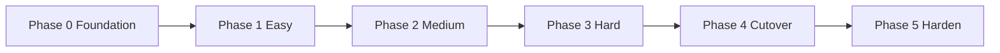

# Implementation plan: grammar-based parsers

Actionable plan to deliver the design in [grammar-based-parsers.md](./grammar-based-parsers.md). Goal: site rules as YAML grammars + one engine; no per-site `extract()` Python.

**Estimate:** ~5–8 focused days end-to-end (engine, recipes, ten sites, fixtures, cutover, docs).

---

## Principles

1. **Parity first** — grammar extract must match Python extract on the same HTML before a site is cut over.
2. **Ship behind a flag** — `--parser-engine=py|grammar|both` until Phase 4; default stays `py`.
3. **Closed vocabulary** — new capability = new strategy type or named recipe, never arbitrary expressions in YAML.
4. **Keep the pipeline contract** — `extract(soup, base_url) → [(text, score, href, pos)]` so `newsextract.py` post-steps stay untouched.
5. **One site at a time** — migrate in ease order; delete Python only after that site’s fixtures pass under `grammar`.

---

## Target layout

```
parsers/
  __init__.py              # discovery + registry (Python and/or grammar)
  base.py                  # CandidateCollector, noise, glue (largely unchanged)
  engine.py                # load / validate / run strategies
  recipes.py               # allowlisted title/link transforms
  schema/
    site.schema.json       # JSON Schema for grammar files
  grammar/
    tv2.yaml
    dr.yaml
    …
tests/
  fixtures/html/<site_id>.html
  fixtures/expected/<site_id>.json   # sorted candidates for golden compare
  test_grammar_parity.py
  test_schema.py
documentation/tech/
  grammar-based-parsers.md
  grammar-parsers-implementation-plan.md   # this file
```

Dependency: add `PyYAML` (or use JSON-only grammars to avoid it — prefer YAML + `pyyaml`).

---

## Phase 0 — Foundation (1–1.5 days)

**Outcome:** engine can load a schema-valid grammar and run the `card` strategy; flag wired; no production behaviour change.

| # | Task | Done when |
|---|------|-----------|
| 0.1 | Add `parsers/schema/site.schema.json` covering metadata + `strategies[]` for `card` only (other types stubbed as `not` / later extensions) | Schema documents required fields: `id`, `name`, `url`, `language`, `domains`, `strategies` |
| 0.2 | Add `parsers/engine.py`: `load_site(path)`, `load_all()`, `extract(site, soup, base_url)` | Raises clear errors with site id + field path |
| 0.3 | Implement strategy `card` (container / title / link / link_fallback / score / optional filters) | TV2-shaped grammar produces candidates |
| 0.4 | Add `parsers/recipes.py` with `text` only; registry dict `RECIPES` | Unknown recipe name fails at load |
| 0.5 | Wire `--parser-engine {py,grammar,both}` in `newsextract.py` (default `py`) | `both` runs both, logs diff summary to stderr, uses `py` result for output |
| 0.6 | Extend `parsers/__init__.py` so grammar sites are discoverable *alongside* Python when engine is `grammar`/`both` | `--list-sites` still works; Python modules remain source of truth for registry until Phase 4 |
| 0.7 | Add `PyYAML` to README install line (and optional `jsonschema` for validation) | Documented install works |
| 0.8 | Create `tests/` skeleton + one TV2 HTML fixture (from cache or a saved fetch) | `pytest` (or `python -m unittest`) runs |

**Exit criteria:** `python newsextract.py --parser-engine=both --only tv2 --update` runs without error; `both` prints zero critical diffs once TV2 grammar exists (Phase 1).

---

## Phase 1 — Easy sites (0.5–1 day)

**Sites:** `tv2`, `dr`, `observer`

| # | Task | Done when |
|---|------|-----------|
| 1.1 | Write `grammar/tv2.yaml`, `grammar/dr.yaml`, `grammar/observer.py` → `observer.yaml` | Files match current Python behaviour |
| 1.2 | Extend engine: `heading_scan` + basic `link` resolution (`self` / `child` / `parent`) | Observer works without recipes beyond `text` |
| 1.3 | DR: two `card`-like or `card` + fallback `select` strategies with scores 9 and 7 | Matches dual-pass DR module |
| 1.4 | Capture fixtures + expected JSON for the three sites | Golden files committed |
| 1.5 | `test_grammar_parity.py`: for each site with a grammar, compare grammar vs Python on fixture (normalize: sort by `(normalize_for_dedup(text), href)`) | CI-local command green |

**Exit criteria:** Three grammars pass parity; `--parser-engine=both --only tv2,dr,observer` reports no diffs on fixtures (and preferably on a live `--update` smoke).

---

## Phase 2 — Medium sites (1–1.5 days)

**Sites:** `politiken`, `nytimes`, `bt`, `berlingske`, `weekendavisen`

| # | Task | Done when |
|---|------|-----------|
| 2.1 | Implement strategy `link_scan` + title preference chains + `href_must` / `href_skip` / `href_skip_endswith` / `min_length` | Politiken grammar parity |
| 2.2 | Move `teaserlink_headline` into `recipes.teaserlink_fluid_lines` (thin wrap of `base.teaserlink_headline`) | BT / Berlingske / Weekendavisen use `type: select` + recipe |
| 2.3 | NYT: `link_scan` + `text_drop_regex` for photo-credit / audio show | Parity on fixture |
| 2.4 | Strategy `select` (match selector → title recipe → link) | TeaserLink trio done |
| 2.5 | Fixtures + expected for all five sites | Parity tests green |
| 2.6 | Extend JSON Schema for `link_scan`, `select`, title/link chain objects, filter fields | Invalid YAML rejected at load |

**Exit criteria:** 8/10 sites have grammars with fixture parity. Python modules still default in production.

---

## Phase 3 — Hard sites (1–1.5 days)

**Sites:** `guardian`, `ekstrabladet`

| # | Task | Done when |
|---|------|-----------|
| 3.1 | Recipe `strip_dcr_quotes`, `first_comma_chunk`; chain support `recipe: [a, b, c]` | Guardian text cleanup matches |
| 3.2 | Link step `ancestor` with `max_depth`, `href_must`, `href_skip` | Guardian pass 2 parity |
| 3.3 | Filters `text_drop_prefix` | Guardian CTA noise dropped |
| 3.4 | `heading_scan` score via recipe `score_by_heading_level`; soft link path with class-hint / min_length (encode `HEADLINE_CLASS_HINTS` as engine built-in when `class_hint: true`) | Ekstra Bladet parity |
| 3.5 | Fixtures + expected for Guardian + EB | Parity green |
| 3.6 | Schema complete for all strategy types and recipes used | `test_schema.py` validates every file under `grammar/` |

**Exit criteria:** All ten sites have grammars; `both` mode clean on all fixtures.

---

## Phase 4 — Cutover (0.5–1 day)

| # | Task | Done when |
|---|------|-----------|
| 4.1 | Switch default `--parser-engine` to `grammar` | Default runs YAML |
| 4.2 | Registry discovery: load only `grammar/*.yaml` (ignore site `.py` except `base`, `engine`, `recipes`) | `--list-sites` lists ten grammar sites |
| 4.3 | Delete site modules: `bt.py`, `berlingske.py`, … (keep `base.py`, `engine.py`, `recipes.py`, `__init__.py`) | Repo has no per-site extract code |
| 4.4 | Align `sites.json` metadata refresh with grammar fields (`name`, `url`, `language`) — same sync behaviour as today | Enabling/disabling unchanged |
| 4.5 | Remove or deprecate `both`/`py` after one release, or keep `py` only if legacy modules remain (they won’t) | Flag simplified to optional debug |
| 4.6 | Update README “Adding a site parser” → add YAML + recipe allowlist note | Docs match reality |
| 4.7 | Link this plan + design doc from README (short “Architecture” bullet) | Discoverable |

**Exit criteria:** Fresh clone, `pip install … pyyaml`, `python newsextract.py --update` works using grammars only.

---

## Phase 5 — Hardening (optional, 0.5 day)

| # | Task | Done when |
|---|------|-----------|
| 5.1 | Warn if a site returns zero candidates after extract | stderr warning with site id |
| 5.2 | `python -m parsers.engine --validate` CLI to schema-check all grammars | Usable in CI / pre-commit |
| 5.3 | Document recipe authoring in `documentation/tech/` (short how-to) | New recipe = PR checklist |
| 5.4 | Decide single source of truth: generate `sites.json` name/url/language from grammar on sync (recommended) | No divergent metadata |

---

## Work sequencing (suggested)



Within each migration phase: **schema fields → engine feature → YAML file → fixture → parity test → smoke `--only`**.

Do not start Phase 4 until Phase 3 parity is green for all sites.

---

## Testing plan

### Fixtures

1. Prefer HTML already in the project cache (if present) so live fetch is not required for CI.
2. Otherwise: one-time `--update --only <id>`, copy raw HTML into `tests/fixtures/html/<id>.html`.
3. Generate expected candidates by running the **Python** parser once; serialize to JSON:

```json
[
  {"text": "…", "score": 9, "href": "https://…"}
]
```

Omit `pos` from equality (or compare separately); compare on normalized text + href + score.

### Parity rules

- Same soup → same multiset of `(normalize_for_dedup(text), href, score)`.
- Allow optional score tolerance only if documented; prefer exact match.
- `both` live mode: print count of only-in-py / only-in-grammar / score mismatches; exit non-zero in CI if any.

### Commands (target)

```bash
pytest tests/test_schema.py tests/test_grammar_parity.py
python newsextract.py --parser-engine=both --only tv2
python -m parsers.engine --validate
```

---

## Integration touchpoints

| File | Change |
|------|--------|
| `newsextract.py` | Flag; call `engine.extract` vs `mod.extract`; `both` diff helper |
| `parsers/__init__.py` | Dual discovery → grammar-only discovery |
| `parsers/base.py` | Keep collector; TeaserLink helper may move behind recipe |
| `README.md` | Install deps; add-site docs |
| `sites.json` | No structural change; metadata may sync from grammar |

No changes expected to HTML UI, categories, or cache format.

---

## Risk register (execution)

| Risk | Response |
|------|----------|
| DR/Guardian dual-pass order changes scores/pos | Preserve strategy order; assert scores in fixtures |
| BeautifulSoup selector quirks vs current code | Use same `soup.select` / `select_one` / `find` APIs as today |
| Fixture HTML goes stale | Re-capture when a site layout breaks; treat fixture update as intentional PR |
| Schema too strict mid-migration | Version schema loosely in Phase 0–2; tighten in Phase 3 |
| Scope creep (XPath, JSON-LD) | Out of scope until all ten sites cut over |

---

## Definition of done (project)

- [ ] All ten sites defined under `parsers/grammar/*.yaml`
- [ ] No per-site `extract()` Python modules remain
- [ ] Engine + recipes + JSON Schema in repo
- [ ] Fixture parity tests for all sites
- [ ] Default CLI path uses grammar engine
- [ ] README documents adding a site via YAML
- [ ] Design doc + this plan remain accurate (update if grammar vocabulary changes)

---

## First PR slice (recommended)

Ship **Phase 0 + TV2 only** as the first mergeable PR:

1. Schema (`card` only) + engine + `text` recipe  
2. `grammar/tv2.yaml`  
3. `--parser-engine` flag (default `py`)  
4. One fixture + parity test for TV2  

Unblocks review of the grammar shape before bulk migration.
